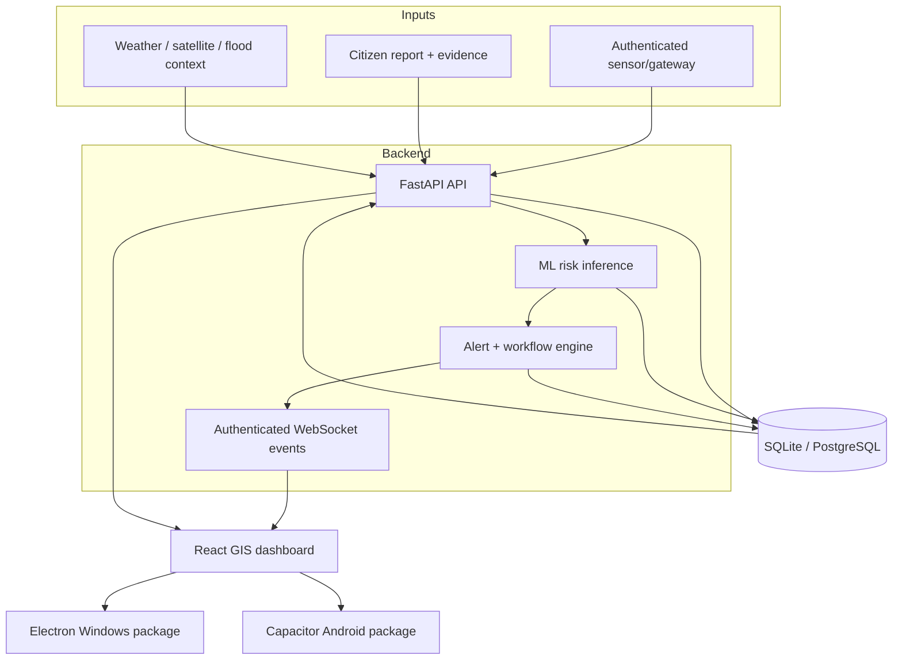

# GeoShield v1.0.0 — Final Project Freeze

## Purpose

This document defines the reproducible final-year major-project software
baseline. It separates what has been verified in software from what still
requires physical field validation.

## Frozen architecture

## Verified software scope

The release baseline includes:

- persistent users, roles and account administration;
- immediate rejection of disabled accounts and revoked sessions;
- monitoring-station create/edit/deactivate/reactivate lifecycle;
- authenticated external sensor/gateway ingestion;
- reading idempotency and source provenance;
- ML inference and persistent risk assessments;
- persistent alerts plus acknowledge/resolve workflow;
- real-time UI refresh with polling fallback;
- GIS risk map and exports;
- citizen-report ownership isolation and evidence access controls;
- PostgreSQL migrations and restart persistence;
- Docker runtime;
- Windows offline workflow;
- self-contained Electron Windows application and NSIS installer;
- Capacitor Android evaluation APK;
- integrity-checked backup/restore of database plus report evidence.

## Automated verification matrix

| Gate | What it proves |
|---|---|
| verify | dependencies, frontend build, backend suite, Docker/runtime/production smoke |
| postgres-integration | migrations + operational behavior + restart persistence |
| browser-e2e | actual Chromium citizen submit/evidence/admin verify workflow |
| security | pip-audit, Bandit and npm dependency audits |
| windows-verification | Windows preparation + offline startup + login/API/frontend |
| android-build | Capacitor sync, APK, dex and debug transport policy |
| electron-windows | bundled Python, packaged app startup/login/stations, NSIS installer |
| disaster-recovery | backup/checksum, destructive DB/uploads loss, restore and evidence recovery |

A green matrix validates these tested paths; it is not a proof that all possible
bugs are impossible.

## Release assets

The release workflow produces:

- `GeoShield-v1.0.0-Setup.exe` — Windows NSIS installer;
- `GeoShield-v1.0.0-Android-Evaluation.apk` — Android evaluation/debug package;
- `SHA256SUMS.txt` — release-file integrity hashes.

The Windows installer is not commercially code-signed. The Android evaluation
APK is not a Play Store production-signed release.

## Security posture at freeze

- production fails closed on weak/missing JWT configuration;
- demo users are disabled in production;
- production user state is checked against the database;
- password reset revokes prior sessions;
- citizen report/evidence access is ownership-scoped;
- sensor ingestion uses a separate API key;
- Python and Node dependency/static security gates run in CI;
- Android cleartext/mixed-content support is opt-in for debug LAN operation only.

## Data and model limitations

The project contains historical, cached, generated and derived data. Model
evaluation is suitable for software/research validation, not for claiming
certified field accuracy. Real deployment requires prospective data, calibrated
sensors, independent labels and threshold calibration.

## Physical deployment still required for field claims

A field pilot would need:

1. calibrated rain, moisture, displacement/tilt and/or pore-pressure sensors;
2. edge/gateway hardware and a selected communication link;
3. buffering/retry testing under real network loss;
4. sensor drift/failure handling;
5. independent event labels and prospective validation;
6. operational escalation procedures reviewed by disaster-management experts.

## Change policy

The `v1.0.0` tag is the immutable academic baseline. Bug/security fixes may be
released as patch versions. New research features should target a later minor
version rather than modifying the frozen release narrative.
