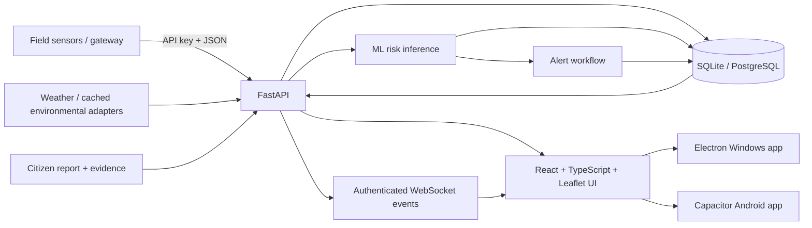

# GeoShield Project Overview

## Final-Year Major Project

**GeoShield** is an AI-based landslide risk monitoring and early-warning
software platform for the North Eastern Region of India. The final software
baseline is released as **v1.0.0**.

The system is a software engineering and research prototype. It is not a
government-certified early-warning service, and field prediction performance
still requires calibrated physical sensors plus prospective independent
validation.

## Problem addressed

Landslide-prone areas need a way to combine telemetry, rainfall/terrain context,
historical data, citizen observations and ML-based risk assessment into one
operational workflow. GeoShield focuses on the software side of that problem:

1. ingest and persist monitoring-station observations;
2. calculate and store risk assessments;
3. create and manage warnings;
4. visualize risk geographically;
5. accept citizen evidence with role-aware access control;
6. support offline/local academic operation as well as PostgreSQL/Docker;
7. remain testable when physical field hardware is unavailable.

## Implemented architecture



### Backend

- FastAPI + Uvicorn
- SQLAlchemy ORM
- Alembic migrations
- SQLite for light/local operation
- PostgreSQL for the full multi-user stack
- JWT RBAC with persistent user reconciliation and session revocation
- authenticated sensor/gateway ingestion
- REST + WebSocket operational APIs

### Frontend

- React 18 + TypeScript + Vite
- Tailwind CSS
- Leaflet GIS
- Recharts
- authenticated real-time refresh plus polling fallbacks

### Desktop and mobile

- Electron Windows package with bundled Python/backend runtime
- NSIS Windows installer
- Capacitor Android debug/evaluation APK
- debug-only LAN HTTP transport is opt-in; normal configuration remains
  cleartext-disabled

## Operational data pipeline

```text
gateway observation
    -> validation + sensor API-key authentication
    -> persistent SensorReading
    -> ML risk inference
    -> persistent RiskAssessment
    -> alert decision
    -> persistent Alert
    -> authenticated real-time event
    -> dashboard / station / alert UI
```

Citizen-report flow:

```text
citizen login
    -> report + geo-coordinates + optional evidence
    -> ownership-bound persistent report
    -> staff review
    -> verify / dismiss
    -> real-time dashboard/report refresh
```

## Roles

- `admin`
- `district_admin`
- `field_officer`
- `citizen`

Production mode disables built-in demo users. An administrator can bootstrap a
persistent account from environment configuration and provision further users
from the Administration UI.

## ML and data statement

GeoShield's inference pipeline is functional, but repository training/evaluation
data have mixed provenance and include generated/derived labels. Evaluation
therefore reports grouped validation and imbalance-aware metrics without
claiming field accuracy. See `DATA_PROVENANCE.md` and the dataset evaluation
documentation.

## Communication-engineering component

The software accepts telemetry from an external gateway. A realistic field chain
is:

```text
sensor -> edge node -> LoRa/LoRaWAN/RS-485/local wireless
       -> gateway buffer -> cellular/broadband backhaul
       -> GeoShield ingestion API
```

Stable `external_id` values allow gateways to resend buffered data without
duplicating observations.

## Verification

The repository CI validates the major software paths on Linux and Windows,
including:

- backend regression suite;
- frontend production build and dependency audits;
- browser E2E citizen-report/admin-review workflow;
- PostgreSQL migrations and persistence across application restart;
- Docker runtime and production-container smoke tests;
- Python dependency and static security scanning;
- Windows offline launcher;
- packaged Electron application plus NSIS installer;
- Capacitor Android APK generation and debug transport policy;
- destructive PostgreSQL backup/restore recovery drill.

See `docs/FINAL_PROJECT_FREEZE.md` for the release evidence and limitations.

## License and provenance

Third-party provenance and adaptation information are retained in
`NOTICE.md`. Dataset provenance and limitations are documented separately.
